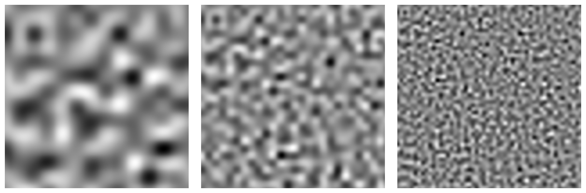
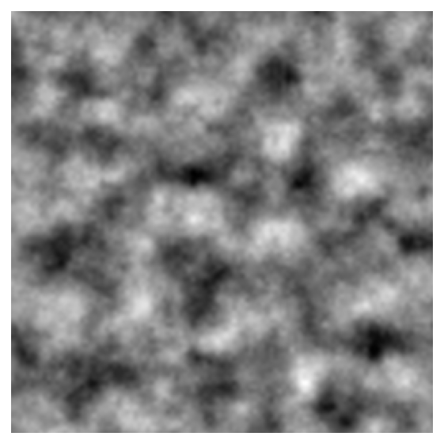

# Wavelet Noise

A simple vectorised Python implementation of the famous Wavelet Noise algorithm. Supports 2D (image) and 3D (single volume or image animation) noise fields with multiple summed octaves. Requires only NumPy and SciPy for computation.

## Parameters

Adjustable parameters include:

- Noise image size ```n```
- Noise frequency ```initial_freq```
- Noise amplitude ```initial_amp```
- Number of noise bands ```nBands```
- Persistence (amplitude scaling factor) ```persistence```
- Lacunarity (frequency scaling factor) ```lacunarity```


## Examples

### Increasing frequency



### Multiscale noise



## References

- Wavelet Noise - Robert L. Cook et al.

## License

This project is licensed under the [MIT License](LICENSE.txt).